# **CSCI 596 Final Project: Visualizing Thermal Equilibrium**

## **Project Objective**
Our project utilizes VMD (Visual Molecular Dynamics) software to simulate and visualize thermal equilibrium. Through a dynamic, color-coded representation of molecules, we illustrate how kinetic energy drives energy exchange within a system. Molecules are assigned colors corresponding to their kinetic energy—warmer colors (e.g., red) represent higher temperatures, while cooler colors (e.g., blue) represent lower temperatures. By placing molecules with distinct initial temperatures in the same simulation box, we visually demonstrate the process of energy exchange leading to thermal equilibrium.

---

## **Motivation**
1. **Making Thermodynamics Tangible**: Thermodynamic principles like thermal equilibrium often seem abstract and theoretical. Our visualization bridges this gap by offering an intuitive and engaging representation of these concepts in action.
2. **Enhancing Learning**: Visual representations make scientific concepts more accessible, helping students and researchers alike deepen their understanding through interactive learning.

<div align="center">
  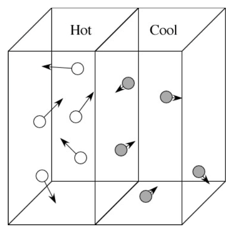
</div>

---

### Steps to Create and Visualize the Simulation

#### **Creating the PDB File**
1. Compile the thermal simulation program:
   ```bash
   gcc -o thermal_md thermal_md.c
2. Run `./thermal_md`. This will create `output.pdb`

#### **Loading the PDB File into VMD** 
1. Open VMD and navigate to Extensions → TK Console.
2. Run `source /path/to/userb.tcl` to load the newly created output.pdb file.
3. In Graphics → Represenations, choose Coloring Method = Beta and Drawing Method = VDW
4. Press the play button to run the simulation.

---

## **Challenges and Key Learnings**
### **1. Initial Visualization Attempt**
We successfully simulated molecular movement to model thermal equilibrium but encountered difficulties implementing color changes using the `.xyz` file format. The resulting visualization lacked the intended color differentiation.  

<div align="center">
  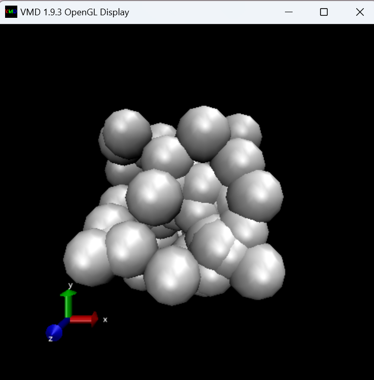
</div>

---

### **2. Transition to `.pmd` Files**
To address the color issue, we pivoted to using `.pmd` files and explored appropriate coloring methods. However, we discovered that kinetic energy values were not being properly read by the simulation.  

<div align="center">
  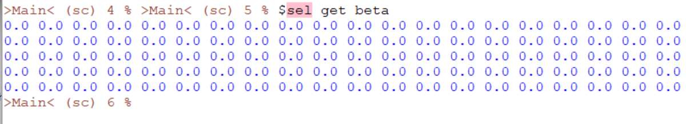
</div>

---

### **3. File Formatting Issues**
We identified that our `.pdb` file formatting did not align with the `.tcl` script. Correcting the file format enabled the simulation to properly read kinetic energy values.  

<div align="center">
  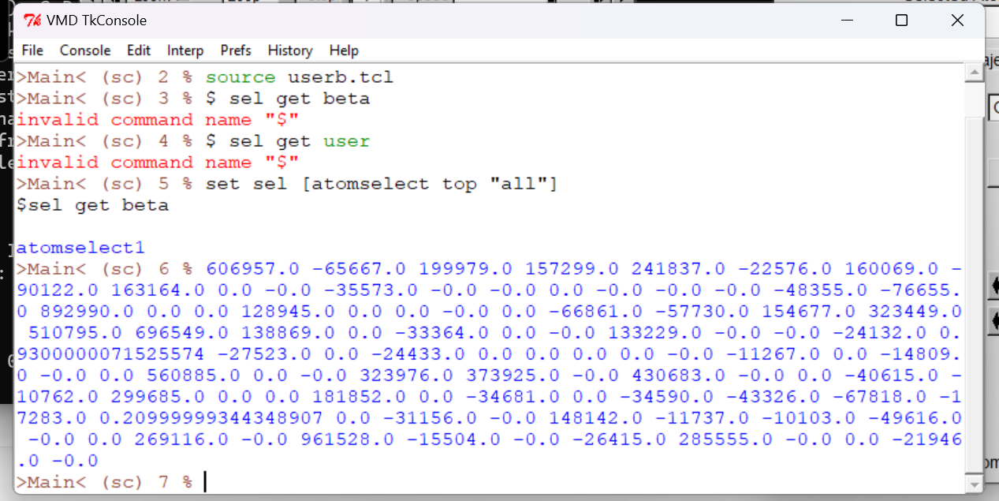
</div>

---

### **4. Resolving Position vs. Kinetic Energy Updates**
While we fixed the file formatting, we noticed that the script only updated atom positions, not their kinetic energy. Below is an example of Atom 1’s position changing over time while its kinetic energy remained constant.  

<div align="center">
  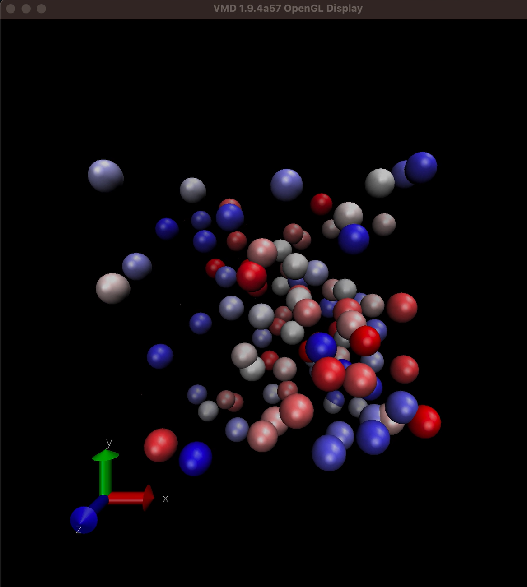
  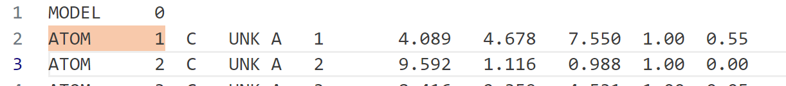
  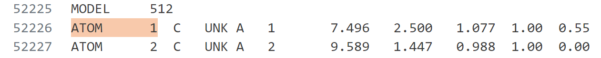
  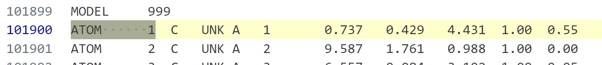
</div>

---

### **5. Final Fixes**
We modified the `thermal_d.c` file to correctly generate an `output.xyz` file where the kinetic energy of atoms changes over time. To accomplish this, we added an `exchange_energy` function to the `thermal_md` script, addressing energy exchange dynamics. Below is Atom 1’s kinetic energy across timesteps, reflecting the expected changes.  

<div align="center">
  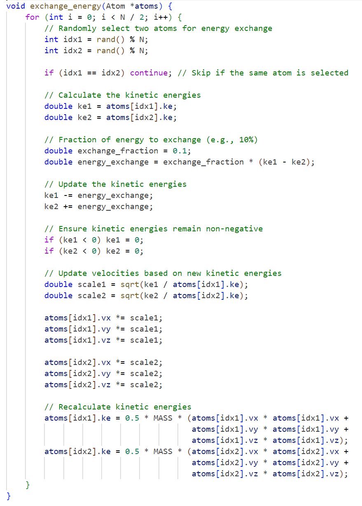
  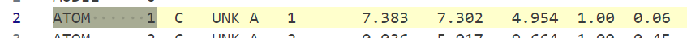
  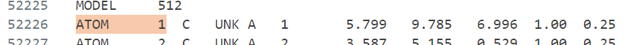
  
</div>

---

## **Latest Update**
Despite generating the correct output file where kinetic energy values change over time, the color changes are still not reflected in the VMD visualization. The atom colors remain static throughout the simulation, failing to dynamically update as intended.  

<div align="center">
  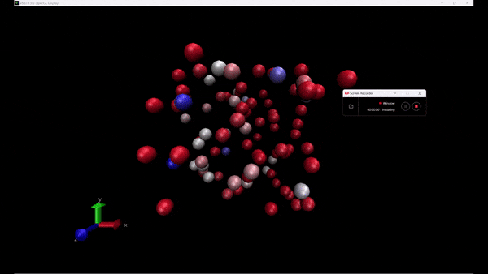
</div>

---

## **Expected Results**
Our final goal is a simulation where molecules with distinct temperatures (represented by colors such as red and blue) exchange energy and reach thermal equilibrium over time. The visualization will clearly demonstrate temperature changes through real-time color updates, making the process of energy flow and distribution both engaging and easy to understand.

---

## **Contributors**
Kaelia Okamura

Kriti Shukla
